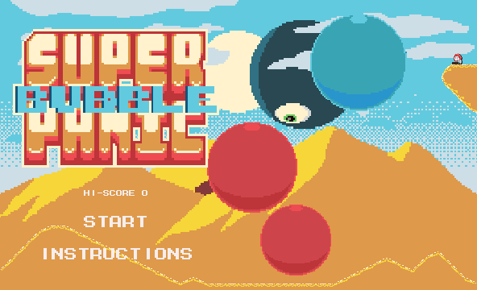

## Credits and License

This game uses the [Phaser](http://phaser.io) framework.
Code copyright holder is [jbpuryear](https://github.com/jbpuryear) and licensed under [CC BY-SA 4.0](https://creativecommons.org/licenses/by-sa/4.0/)

### Images

All images created by [jbpuryear](https://github.com/jbpuryear) except for:
* The city, desert, space, and living tissue background, and the Living Tissue Tileset which are based on (better) works by [Ansimuz](http://ansimuz.com)
* The ocean background by KnoblePersona (palette swapped)
* logo.png and go.png which use a pallette swapped version of [Pixel Block Font ](https://opengameart.org/content/pixel-block-font) by [J-Robot](https://j-robotson.tumblr.com/)
* Small-font.png

All images licenced under [CC0](https://creativecommons.org/publicdomain/zero/1.0/) except for:
* The Living Tissue tileset and background [CC BY 3.0](http://creativecommons.org/licenses/by/3.0/)
* Images which use Pixel Block Font [CC BY 3.0](http://creativecommons.org/licenses/by/3.0/)
* The ocean background [CC BY 3.0](http://creativecommons.org/licenses/by/3.0/)

### Music

This game uses the following tracks provided by [Free Music Archive](http://freemusicarchive.org):

| Title and author | License |
|------------------|---------|
| [NRIN HUS](http://freemusicarchive.org/music/C_C/Impendulo/05_-_NRIN_HUS) by [C\_C](http://freemusicarchive.org/music/C_C/) |  
| [Memory](http://freemusicarchive.org/music/Creo/~/Memory_1520) by [Creo](http://freemusicarchive.org/music/Creo/) | 
| [2 Spring\_Summer](http://freemusicarchive.org/music/Dustin_Wong/Seasons/2_Spring_Summer) by [Dustin Wong](http://freemusicarchive.org/music/Dustin_Wong/) | 
| [Everything Is Changing](http://freemusicarchive.org/music/Noi/~/noi_-_everything_is_changin) by [Noi](http://freemusicarchive.org/music/Noi/) | 
| [N35-40-19-800](http://freemusicarchive.org/music/springtide/This_is_the_End/N35-40-19-800) by [Springtide](http://freemusicarchive.org/music/springtide/) | 
| [Gone](https://opengameart.org/content/gone) by Alex McCulloch | 
| [Venus](https://opengameart.org/content/nes-shooter-music-5-tracks-3-jingles) by SketchyLogic | 
| [Space](https://opengameart.org/content/space-1) by [Alexandr Zhelanov] (https://soundcloud.com/alexandr-zhelanov) | 
| [Observing The Star](https://opengameart.org/content/another-space-background-track) by Yd | 

### Sound FX

This game uses the following sound files from [Open Game Art](https://opengameart.org/):

| Name and author | License |
|-----------------|---------|
| [Jet Engine Takeoff](https://opengameart.org/content/jet-engine-takeoff) by [dklon](https://opengameart.org/users/dklon) |  |
| [2 Hich Quality Explosions](https://opengameart.org/content/2-high-quality-explosions), [Chaingun, pistol, rifle, shotgun shots](https://opengameart.org/content/chaingun-pistol-rifle-shotgun-shots), and [4 projectile launches](https://opengameart.org/content/4-projectile-launches) by Michel Baradari |  |
| All other sounds |  |
